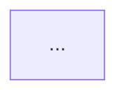

# Spec / plan folder layout + mermaid render

The shape is rigid because reviewers and downstream tooling depend on it. Get this wrong and the PR will bounce.

## Folder layout

### Per-ticket spec

```
docs/superpowers/specs/<BRANCH-NAME>/
  YYYY-MM-DD-<topic>-design.md       # the spec narrative
  architecture.md                    # mermaid blocks rendered inline
  diagrams/
    01-<descriptive-name>.mmd
    01-<descriptive-name>.png
    02-<descriptive-name>.mmd
    02-<descriptive-name>.png
    ...
```

`<BRANCH-NAME>` matches the git branch exactly (e.g., `ITAECD-378-ba-case-auto-fill-expected-fields`). No `feature/` prefix in the folder name.

### Per-ticket plan

```
docs/superpowers/plans/<BRANCH-NAME>/
  YYYY-MM-DD-<topic>-plan.md
  architecture.md
  diagrams/
    NN-<descriptive-name>.mmd + .png
```

### Multi-ticket feature umbrella

```
docs/superpowers/features/<feature-name>/
  ticket-driven-development.md       # pipeline + scope per ticket + open questions
  architecture.md                    # cross-ticket end-state view, stable contracts
  diagrams/
    NN-<descriptive-name>.mmd + .png
```

The umbrella is the cross-ticket index. Per-ticket details still live in `specs/<branch>/` and `plans/<branch>/` — link to each from `ticket-driven-development.md`.

## Filename rules

- **Kebab-case** for the descriptive part.
- **Numeric prefix `NN-`** preserves diagram order. `01-`, `02-`, …
- **Descriptive enough to read at a glance**. `arch-01.mmd` is wrong; `01-system-view.mmd`, `02-orchestrator-flow.mmd`, `03-error-paths.mmd` are right.
- **Paired `.mmd` + `.png`** in `diagrams/`. The `.mmd` is source-of-truth; the `.png` is what reviewers see.

## Diagram content rules

- **Spec diagrams** depict the *system end-state*: components, contracts, data flow, what changes.
- **Plan diagrams** depict the *work*: task DAG, phase progression, breakage timeline, test growth, commit cadence.

A spec diagram answers "what does the world look like after this lands?" A plan diagram answers "how does the world get there?"

## Mermaid → PNG render

Use `@mermaid-js/mermaid-cli` via `npx`. **The `--scale 3 -w 1600` flags are required** — defaults produce blurry output that reviewers will reject.

### One-time setup

Create `/tmp/puppeteer-config.json`:

```json
{ "args": ["--no-sandbox", "--disable-setuid-sandbox"] }
```

The `--no-sandbox` flag matters because the WSL2 + Chromium combination otherwise crashes on the sandbox check.

### Render command

```bash
npx -y @mermaid-js/mermaid-cli \
  -i diagrams/<name>.mmd \
  -o diagrams/<name>.png \
  -p /tmp/puppeteer-config.json \
  -b transparent \
  --scale 3 -w 1600
```

Flag breakdown:

| Flag | Why |
|------|-----|
| `-p /tmp/puppeteer-config.json` | Pass the no-sandbox args for WSL2 Chromium. |
| `-b transparent` | Transparent background so the PNG composes cleanly into both light and dark Confluence/GitHub. |
| `--scale 3` | 3x render — required for legibility at standard zoom. |
| `-w 1600` | Wider canvas — prevents text wrap that defaults force. |

### Batch render all diagrams in a folder

```bash
for f in diagrams/*.mmd; do
  npx -y @mermaid-js/mermaid-cli \
    -i "$f" \
    -o "${f%.mmd}.png" \
    -p /tmp/puppeteer-config.json \
    -b transparent --scale 3 -w 1600
done
```

Run this from the spec or plan folder.

## architecture.md structure

`architecture.md` embeds the mermaid sources inline as fenced blocks, *and* references the rendered PNGs. The pattern:

````markdown
# Architecture — <ticket title>

## <Section name, matches the diagram>

<one paragraph describing what the diagram shows and why it's the right view>




## <next section>
...
````

The mermaid block is the source of truth — the PNG is rendered *from* it. When you change the diagram, edit the `.mmd` *and* the inline block in `architecture.md`, then re-render. Mismatch between the two is a review blocker.

## Reference example

[docs/superpowers/specs/ITAECD-378-ba-case-auto-fill-expected-fields/](../../../docs/superpowers/specs/ITAECD-378-ba-case-auto-fill-expected-fields/) shows the full shape: design doc + architecture.md with inline mermaid + diagrams folder with `.mmd` + `.png` pairs. Open it side-by-side when shaping a new spec.

## Common mistakes (and what they look like)

| Mistake | Symptom | Fix |
|---------|---------|-----|
| Missing `--scale 3` | Reviewers say "diagram is blurry" | Re-render with the flag. |
| Non-descriptive filename (`arch-01.png`) | Hard to skim the folder | Rename `.mmd` + `.png`, update `architecture.md` references. |
| `.mmd` and inline block diverged | Two diagrams show different things | Edit both, re-render. |
| `feature/` prefix in folder name | Spec folder doesn't match `<BRANCH-NAME>` | Rename folder; the prefix is on the branch, not the folder. |
| Plan diagrams depict end-state | Plan looks like a duplicate spec | Re-diagram the *work* — task DAG, phase progression. |
